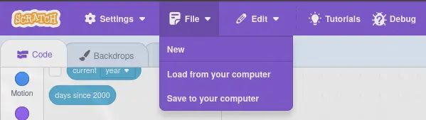

# Scrapile
---
> A somewhat fully-fleged rust-like programming language that, surprisingly, compiles to scratch

# Guide
---
## How to install
Make sure you have a rust toolchain of your liking installed and then run:
```sh
cargo install scrapile
```
Otherwise, if building it yourself isn't an option (rust toolchain isn't installed).
You can download pre-built binaries for `linux-gnu`, `linux-musl` and `windows` in the **releases** section and then add it to your `PATH` environemnt variable.

## How to use it
To compile a scrapile project:
- `scrapile <source-code>.srpl <output_path>.sb3`
- then simply upload the resulting file to scratch

## Basic Hello World
1. First create a new scrapile project with the contents:
  ```scrapile
  main { // the program starts executing at the main block
    println!("hello, world!"); // 'println' is a builtin function and "hello, world" is it's argument
  }
  ```
2. Then run the command `scrapile <source-code>.srpl <output_path>.sb3` to compile the source code.
3. After that, you can upload the resulting `.sb3` file to scratch by opening their website, creating a new empty project, opening the file tab and hitting 'Load from your computer'.
  - 
4. Then, once the project is imported, simply hit the green flag and "hello, world" should be printed to the console.

## Other examples
Other examples can be found in the examples directory and include:
- `examples/showcase.srpl` which showcases **all the language's features**.
- a simple benchmark (`examples/benchmark.srpl`) for the language's speed
- a simple brainfuck interpreter `examples/brainfuck.srpl`
